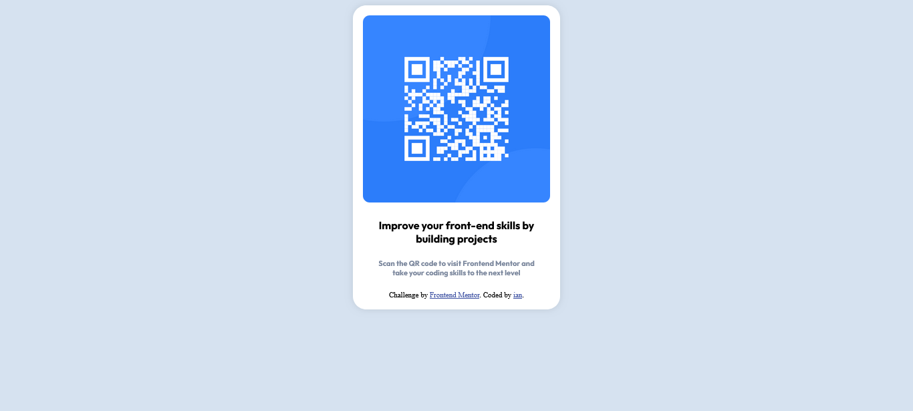

# Frontend Mentor - QR code component solution

This is a solution to the [QR code component challenge on Frontend Mentor](https://www.frontendmentor.io/challenges/qr-code-component-iux_sIO_H). Frontend Mentor challenges help you improve your coding skills by building realistic projects. 

## Table of contents

- [Overview](#overview)
  - [Screenshot](#screenshot)
  - [Links](#links)
- [My process](#my-process)
  - [Built with](#built-with)
  - [What I learned](#what-i-learned)
  - [Useful resources](#useful-resources)
- [Author](#author)
- [Acknowledgments](#acknowledgments)

## Overview

### Screenshot

### Links

- Solution URL: [Add solution URL here](https://github.com/iancalbreath/frontendmentor1.git)
- Live Site URL: [Add live site URL here](https://your-live-site-url.com)

## My process

bash head against keyboard

### Built with

- VSCode
- CSS custom properties
- Flexbox

### What I learned

learned a ton of HTML and CSS and just the overall structure of things and how to reference things in html from the css stylesheet.

### Useful resources

w3, Reddit, ChatGPT

## Author

- Github - [iancalbreath](https://github.com/iancalbreath)
- Frontend Mentor - [@iancalbreath](https://www.frontendmentor.io/profile/iancalbreath)

## Acknowledgments

Shoutout to Allan Mendoza - futuro cunado - for sparking my interest in web development
